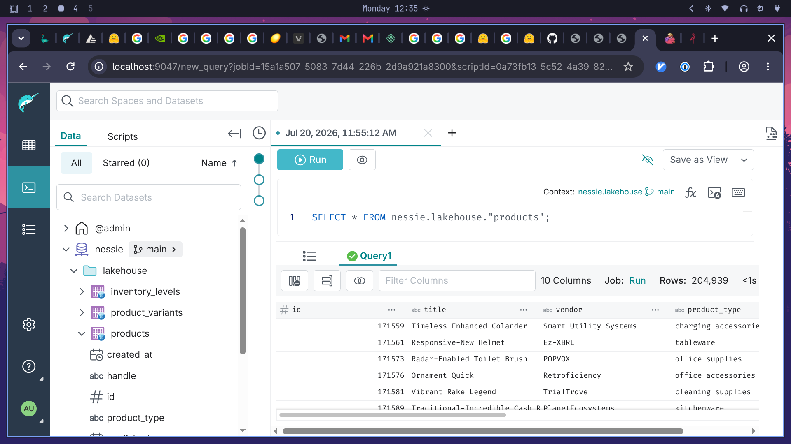
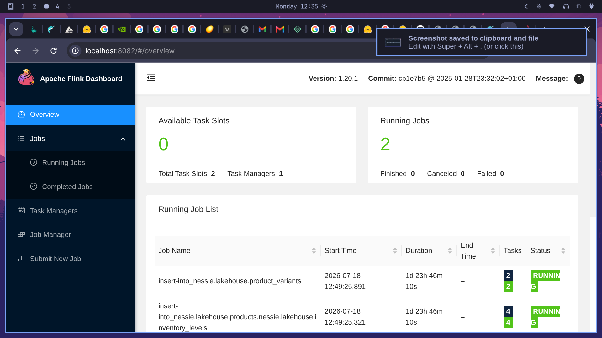
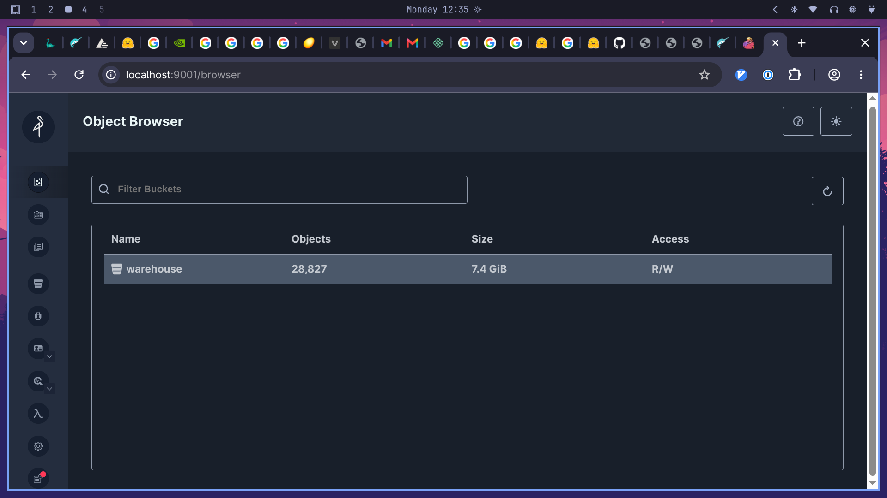
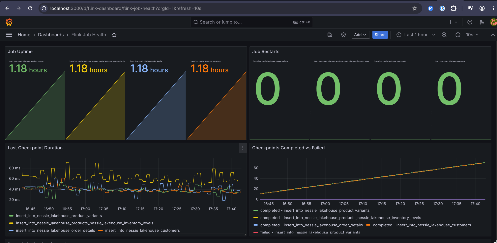
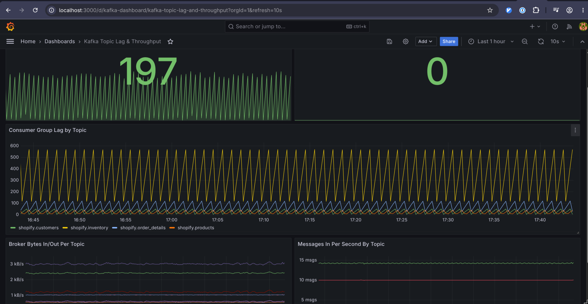
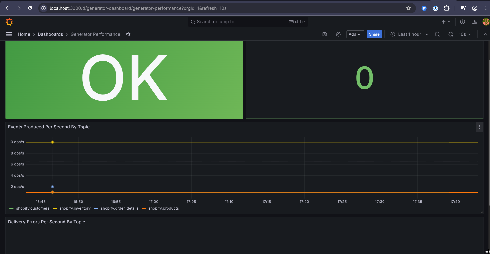

# shopify-lakehouse

A self-contained reference implementation of a streaming ELT lakehouse pipeline using simulated Shopify data. Useful for testing and validating Iceberg-based lakehouse architectures end-to-end without a live Shopify store.

See [CHANGELOG.md](CHANGELOG.md) for recent changes.

## Architecture

```
┌─────────────────────────────────────────────────────────────────────────┐
│                          Docker network: lakehouse                       │
│                                                                         │
│  ┌─────────────┐   Avro/    ┌───────────┐  ┌──────────────────────┐   │
│  │  Generator  │──────────▶ │   Kafka   │  │   Schema Registry    │   │
│  │   (Go)      │  Confluent │  (KRaft)  │  │   (Confluent CP)     │   │
│  │             │   wire fmt │           │◀─│                      │   │
│  │  products   │            │shopify.   │  │  shopify.products    │   │
│  │  1 event/s  │            │products   │  │  -value (Avro)       │   │
│  │             │            │           │  │  shopify.inventory   │   │
│  │  inventory  │            │shopify.   │  │  -value (Avro)       │   │
│  │  10 events/s│            │inventory  │  └──────────────────────┘   │
│  └─────────────┘            └─────┬─────┘                             │
│                                   │                                    │
│                            reads (avro-confluent)                      │
│                                   │                                    │
│                                   ▼                                    │
│                    ┌──────────────────────────────┐                   │
│                    │         Flink 1.20            │                   │
│                    │   (JobManager + TaskManager)  │                   │
│                    │                               │                   │
│                    │  Job 1 (STATEMENT SET)        │                   │
│                    │  ├── products_source          │                   │
│                    │  │   → lakehouse.products     │                   │
│                    │  └── inventory_source         │                   │
│                    │      → lakehouse.inventory_   │                   │
│                    │        levels                 │                   │
│                    │                               │                   │
│                    │  Job 2                        │                   │
│                    │  └── products_source          │                   │
│                    │      → UNNEST(variants)       │                   │
│                    │      → lakehouse.product_     │                   │
│                    │        variants               │                   │
│                    └──────────────┬───────────────┘                   │
│                                   │ HadoopFileIO / s3a://             │
│                    ┌──────────────▼───────────────┐                   │
│                    │     Nessie  (Iceberg catalog) │                   │
│                    │     + version store (RocksDB) │                   │
│                    └──────────────┬───────────────┘                   │
│                                   │                                    │
│                    ┌──────────────▼───────────────┐                   │
│                    │     MinIO  (s3a://warehouse/) │                   │
│                    │     Iceberg data + metadata   │                   │
│                    └──────────────┬───────────────┘                   │
│                                   │                                    │
│          ┌────────────────────────┴────────────────────────┐          │
│          │                                                  │          │
│  ┌───────▼────────┐                              ┌─────────▼────────┐ │
│  │ Spark 3.5      │                              │  Dremio OSS      │ │
│  │ (compaction)   │                              │  (query engine)  │ │
│  │                │                              │                  │ │
│  │ Every 600s:    │                              │  SQL over        │ │
│  │ rewrite_data_  │                              │  Iceberg via     │ │
│  │ files          │                              │  Nessie source   │ │
│  │ rewrite_mani-  │                              │  :9047           │ │
│  │ fests          │                              │                  │ │
│  │ expire_snap-   │                              │  ⚠ see setup.md  │ │
│  │ shots          │                              │                  │ │
│  └────────────────┘                              └──────────────────┘ │
└─────────────────────────────────────────────────────────────────────────┘
```

> **Interactive graph:** [Explore the codebase knowledge graph](https://netlogics.github.io/shopify-lakehouse/graphify-out/graph.html) — nodes, communities, and cross-cutting connections, powered by [graphify](https://pypi.org/project/graphifyy/).

**Dremio** — ad-hoc SQL over Iceberg tables (`:9047`)



**Flink** — 2 streaming ingest jobs running continuously (`:8082`)



**MinIO** — object storage holding all Iceberg data and metadata (`:9001`)



**Flink dashboard (Grafana)** — job uptime, checkpointing, and the pipeline-throughput panel (`:3000`)



**Kafka dashboard (Grafana)** — consumer lag, throughput, and messages per topic (`:3000`)



**Generator dashboard (Grafana)** — backpressure state and event throughput (`:3000`)



### Data flow summary

1. **Generator** seeds 100 products on startup, then continuously emits events to **four Kafka topics** encoded as Avro using the Confluent wire format:
   - `shopify.products` (1/s) — products with embedded variants
   - `shopify.inventory` (10/s) — inventory level updates
   - `shopify.order_details` (2/s) — order line items
   - `shopify.customers` (1/s) — customer records
   
   All events carry a unique `event_id` (UUID v4) for deduplication. Schemas are registered with Schema Registry on first run.
   
   **Note**: `order_details` and `customers` sources use `latest-offset` startup mode to handle first-run offset discovery. Existing consumer groups will use committed offsets if available.

2. **Flink** runs **four streaming jobs** that read from Kafka, apply transformations, and sink to **five Iceberg tables** via the Nessie catalog:
   - `nessie.lakehouse.products` — one row per product event
   - `nessie.lakehouse.product_variants` — one row per variant (UNNEST)
   - `nessie.lakehouse.inventory_levels` — one row per inventory event
   - `nessie.lakehouse.order_details` — one row per order line item
   - `nessie.lakehouse.customers` — one row per customer event

3. **Spark** runs a compaction loop every 10 minutes across **all five Iceberg tables** — bin-packing small files, rewriting manifests, and expiring snapshots older than 1 hour (retains last 5).

4. **Dremio** provides an ad-hoc SQL query interface over the Iceberg tables via the Nessie source. See [`dremio/setup.md`](dremio/setup.md) for first-run configuration.

5. **Webhook-service** (optional) — Next.js app that receives Shopify webhooks, validates HMAC signatures, and persists to SQLite for dashboard/explorer access.

### Iceberg tables

| Table | Partitioned by | Source | Notes |
|---|---|---|---|
| `nessie.lakehouse.products` | — | `shopify.products` topic | Low-cardinality `status` partition removed |
| `nessie.lakehouse.product_variants` | — | `shopify.products` topic (UNNEST) | |
| `nessie.lakehouse.inventory_levels` | `location_id` | `shopify.inventory` topic | Only partitioned table |
| `nessie.lakehouse.order_details` | — | `shopify.order_details` topic | Low-cardinality `fulfillment_status` removed |
| `nessie.lakehouse.customers` | — | `shopify.customers` topic | Low-cardinality `state` removed |

---

## Services

| Service | Image | Port | Purpose |
|---|---|---|---|
| `kafka` | `confluentinc/cp-kafka:7.9.0` | `29092` (host) | Kafka broker (KRaft, no ZooKeeper) |
| `schema-registry` | `confluentinc/cp-schema-registry:7.9.0` | `8081` | Confluent Schema Registry |
| `kafka-init` | `confluentinc/cp-kafka` | — | Creates **4 topics**: products, inventory, order_details, customers |
| `minio` | `minio/minio` | `9000`, `9001` (console) | S3-compatible object storage; holds all Iceberg data files |
| `minio-init` | `minio/mc` | — | Creates the `warehouse` bucket once on startup |
| `nessie` | `ghcr.io/projectnessie/nessie:0.103.3` | `19120` | Iceberg catalog with Git-like branching (RocksDB backend) |
| `flink-jobmanager` | `shopify-lakehouse/flink:1.20.1` | `8082` (UI) | Flink cluster job manager |
| `flink-taskmanager` | `shopify-lakehouse/flink:1.20.1` | — | Flink task slots (4 slots) |
| `flink-sql-submit` | `shopify-lakehouse/flink:1.20.1` | — | One-shot container: submits `ingest.sql` then exits |
| `generator` | `shopify-lakehouse/generator` | — | Go service: produces faux Shopify events to Kafka (with backpressure) |
| `spark-compaction` | `shopify-lakehouse/spark:3.5.4` | — | Periodic Iceberg compaction loop (5 tables) |
| `dremio` | `dremio/dremio-oss:25.2` | `9047` | SQL query engine (requires manual source setup — see below) |
| `dremio-bootstrap` | `curlimages/curl` | — | Attempts automated Dremio Nessie source registration |
| `webhook-service` | `shopify-lakehouse/webhook-service` | `3456` | Next.js Shopify webhook receiver + dashboard + data explorer |
| `prometheus` | `prom/prometheus` | `9090` | Metrics collection: webhook-service, Flink, Kafka (JMX + consumer-lag exporters), generator |
| `grafana` | `grafana/grafana` | `3000` | Dashboards + alerting (admin/admin) — webhook, Flink, Kafka, generator |
| `kafka-jmx-exporter` | `shopify-lakehouse/kafka-jmx-exporter` | `5556` | Bridges Kafka broker JMX metrics (throughput, ISR churn, GC) to Prometheus |
| `kafka-exporter` | `danielqsj/kafka-exporter` | `9308` | Consumer-group lag/offsets via the Kafka admin protocol (not derivable from JMX) |

---

## Monitoring

Prometheus scrapes five sources; Grafana visualizes them with four dashboards and three alert rules.

| Target | Scraped via | What it covers |
|---|---|---|
| `webhook-service` | Next.js `/api/metrics` route | Webhook events received, by type |
| `flink-jobmanager` / `flink-taskmanager` | Flink's built-in Prometheus reporter (`:9249`) | Job uptime, restarts, checkpoint duration/failures, records in/out |
| `kafka-jmx-exporter` | jmx_exporter httpserver mode, connects to the broker's JMX RMI port | Broker-internal metrics: per-topic throughput, request handler idle %, ISR churn, log size |
| `kafka-exporter` | `danielqsj/kafka-exporter`, talks the Kafka admin protocol | Consumer-group lag and offsets |
| `generator` | Go `/metrics` endpoint (`:2112`, `prometheus/client_golang`) | Events produced, delivery errors, backpressure state — all by topic |

**Why two Kafka exporters instead of one:** `kafka-exporter` only knows what its own code implements — consumer-group lag/offsets, topic/partition counts. It can't see anything broker-internal (throughput, GC, ISR churn, request latency). The JMX exporter is a generic bridge to Kafka's full MBean tree, so extending it later (e.g. request latency percentiles) is just adding a pattern to `kafka/jmx-exporter/config.yml` — no new service. Consumer lag, on the other hand, is fiddly to derive correctly from JMX alone (walking `__consumer_offsets`), so `kafka-exporter` stays for that one metric family. Kafka JMX itself is enabled via `KAFKA_JMX_PORT`/`KAFKA_JMX_HOSTNAME` on the `kafka` service (`compose/kafka.yml`) — the exporter connects out to it; nothing is injected into Kafka's own JVM.

**Dashboards** (`compose/grafana/provisioning/dashboards/`): `webhook-dashboard`, `flink-dashboard` (job health/checkpointing, plus a "Pipeline Throughput: Produced → Flink → Iceberg" panel comparing Kafka messages produced, Flink records consumed, and Iceberg records committed side by side over a sliding window), `kafka-dashboard` (lag + throughput), `generator-dashboard` (throughput/errors/backpressure).

**Alerting**: Grafana's built-in unified alerting (`compose/grafana/provisioning/alerting/rules.yml`), evaluated every minute against the same Prometheus datasource — no separate Alertmanager service. Three rules: Flink job restarts, Kafka consumer lag > 1000, generator backpressure active for 2+ minutes. No contact point is provisioned, so alerts fire and appear under Grafana's Alerting UI but aren't routed anywhere by default — add a contact point (email/Slack/webhook) via the UI or provisioning if you want notifications delivered.

Access: Grafana at `http://localhost:3000` (`admin`/`admin`), Prometheus at `http://localhost:9090`.

---

## Prerequisites

- Docker with Compose V2 (`docker compose`)
- ~8 GB of available RAM (Dremio alone uses 4 GB by default)
- Ports `8081`, `8082`, `9000`, `9001`, `9047`, `19120`, `29092`, `3000`, `3456`, `9090`, `9249`, `9250`, `9308`, `5556`, `2112` free on the host

---

## Quickstart

```bash
# 1. Clone
git clone https://github.com/netlogics/shopify-lakehouse.git
cd shopify-lakehouse

# 2. Build custom images (Flink + Spark + Generator)
docker compose build

# 3. Start the stack
docker compose up -d

# 4. Watch service health
docker compose ps

# 5. Tail Flink job submission
docker compose logs -f flink-sql-submit

# 6. Confirm Flink jobs are running
open http://localhost:8082   # Flink UI

# 7. Browse raw files in MinIO
open http://localhost:9001   # MinIO console (minioadmin / minioadmin)

# 8. Query via Dremio (requires one-time source setup — see dremio/setup.md)
open http://localhost:9047
```

> **Dremio note:** the automated `dremio-bootstrap` container attempts to register the Nessie source on first run, but this is known to be unreliable. Follow [`dremio/setup.md`](dremio/setup.md) to configure the source manually if the bootstrap does not complete successfully.

### Useful commands

```bash
# Check all service logs
docker compose logs -f

# Run Flink SQL interactively
docker compose exec flink-jobmanager \
  /opt/flink/bin/sql-client.sh

# Query Iceberg table counts via Spark
docker compose exec spark-compaction \
  /opt/spark/bin/spark-sql \
  --conf spark.sql.catalog.nessie=org.apache.iceberg.spark.SparkCatalog \
  --conf spark.sql.catalog.nessie.catalog-impl=org.apache.iceberg.nessie.NessieCatalog \
  --conf spark.sql.catalog.nessie.uri=http://nessie:19120/api/v1 \
  --conf spark.sql.catalog.nessie.ref=main \
  --conf spark.sql.catalog.nessie.warehouse=s3a://warehouse/ \
  -e "SELECT COUNT(*) FROM nessie.lakehouse.products"

# Trigger a manual compaction run
docker compose restart spark-compaction

# Tear down (preserves data volumes)
docker compose down

# Tear down and wipe all data
docker compose down -v
```

---

## Configuration

All tuneable parameters live in `.env`. Key values:

### Generator rates (`generator/config.yaml`)

| Key | Default | Description |
|---|---|---|
| `products.rate` | `1/s` | New product events per second |
| `products.seed_count` | `100` | Products published on startup |
| `inventory.rate` | `10/s` | Inventory update events per second |
| `inventory.locations` | `3` | Number of simulated warehouse locations |
| `order_details.rate` | `2/s` | Order detail events per second |
| `customers.rate` | `1/s` | Customer events per second |

| Variable | Default | Description |
|---|---|---|
| `KAFKA_TOPIC_PRODUCTS` | `shopify.products` | Products Kafka topic name |
| `KAFKA_TOPIC_INVENTORY` | `shopify.inventory` | Inventory Kafka topic name |
| `KAFKA_TOPIC_PARTITIONS` | `3` | Partition count for both topics |
| `KAFKA_TOPIC_RETENTION_MS` | `604800000` | Topic retention (7 days) |
| `WAREHOUSE_BUCKET` | `warehouse` | MinIO bucket for Iceberg files |
| `AWS_ACCESS_KEY_ID` | `minioadmin` | MinIO access key (also used by Flink + Spark) |
| `AWS_SECRET_ACCESS_KEY` | `minioadmin` | MinIO secret key |
| `NESSIE_VERSION_STORE_TYPE` | `ROCKSDB` | Nessie backend (`ROCKSDB` or `IN_MEMORY`) |
| `COMPACTION_INTERVAL` | `600` | Seconds between Spark compaction runs |
| `DREMIO_MAX_MEMORY_SIZE_MB` | `4096` | Dremio JVM heap limit |

Generator rates can be adjusted in `generator/config.yaml`:

| Key | Default | Description |
|---|---|---|
| `products.rate` | `1/s` | New product events per second |
| `products.seed_count` | `100` | Products published on startup |
| `inventory.rate` | `10/s` | Inventory update events per second |
| `inventory.locations` | `3` | Number of simulated warehouse locations |

---

## Flink image

The custom Flink image (`flink/Dockerfile`) extends the stock `flink:1.20.1` image with:

- `flink-sql-connector-kafka` 3.4.0-1.20
- `flink-sql-avro-confluent-registry` 1.20.1
- `iceberg-flink-runtime-1.20` 1.9.1
- `iceberg-nessie` 1.9.1 + transitive deps (resolved via Maven)
- `hadoop-aws` + `aws-java-sdk-bundle` 1.12.780 (S3A → MinIO via `HadoopFileIO`)
- `iceberg-aws-bundle` 1.9.1 (optional S3FileIO support)

> **S3 configuration**: The Nessie catalog uses `HadoopFileIO` with S3A filesystem. Environment variables `AWS_ACCESS_KEY_ID`, `AWS_SECRET_ACCESS_KEY`, and `AWS_REGION` are required for S3 connectivity.

---

## Project structure

```
.
├── compose/              # Per-service Docker Compose files (included by root)
│   ├── flink.yml
│   ├── generator.yml
│   ├── kafka.yml
│   ├── minio.yml
│   ├── nessie.yml
│   ├── spark.yml
│   └── dremio.yml
├── docker-compose.yml    # Root compose — includes all of the above
├── .env                  # All tuneable config
├── flink/
│   ├── Dockerfile        # Custom Flink image with Iceberg/Kafka/Nessie deps
│   ├── core-site.xml     # Hadoop S3A config for MinIO
│   └── sql/
│       └── ingest.sql    # Flink SQL: Kafka sources, Nessie catalog, Iceberg sinks
├── generator/            # Go service: Shopify event generator
│   ├── cmd/generator/    # main entrypoint
│   ├── internal/
│   │   ├── config/       # YAML config + env overrides
│   │   ├── gen/          # Fake product/inventory data generation
│   │   ├── model/        # Go structs matching Avro schemas
│   │   └── producer/     # Confluent Kafka producer + Schema Registry
│   └── config.yaml       # Default generator rates and topic names
├── schemas/              # Avro schemas (source of truth for Kafka topics)
│   ├── product.avsc
│   ├── inventory_level.avsc
│   ├── order_detail.avsc
│   └── customer.avsc
├── spark/
│   ├── Dockerfile        # Spark image with Iceberg + Nessie jars
│   ├── compact.py        # Compaction script (rewrite, manifests, expire)
│   └── entrypoint.sh     # Loop wrapper: runs compact.py every $COMPACTION_INTERVAL
├── kafka/
│   └── init-topics.sh    # Creates shopify.products and shopify.inventory
├── minio/
│   └── init-bucket.sh    # Creates the warehouse bucket
└── dremio/
    ├── bootstrap.sh      # Automated Nessie source registration (best-effort)
    └── setup.md          # Manual Dremio setup guide
├── webhook-service/      # Next.js Shopify webhook receiver + dashboard
│   ├── app/
│   │   ├── api/webhooks/ # HMAC-verified webhook receiver
│   │   ├── page.tsx      # Dashboard with resource counts
│   │   └── explorer/     # Data explorer with table browser + SQL editor
│   ├── prisma/
│   │   └── schema.prisma # 6 tables (Products, Variants, Inventory, Orders, Customers, Webhooks)
│   └── Dockerfile
└── ruby-kafka-consumer/  # Ruby/Karafka consumer for order_details (optional)
```

---

## Recommended Next Steps

### High Priority

1. **End-to-end verification** — Start the full stack and verify data flow:
   ```bash
   docker compose up -d
   docker compose logs -f flink-sql-submit  # Wait for "Job switched to RUNNING"
   docker compose exec spark-compaction /opt/spark/bin/spark-sql \
     -e "SELECT COUNT(*) FROM nessie.lakehouse.products"  # Should grow over time
   ```

2. **Webhook-service integration** — Connect webhook-service to the lakehouse:
   - Add a background job to sync SQLite data → Iceberg (via Spark or Flink)
   - Or replace the generator with real Shopify webhook payloads

### Medium Priority

4. **Schema registry validation** — Ensure all 4 Avro schemas are registered:
   ```bash
   curl http://localhost:8081/subjects  # Should show 4 subjects
   ```

5. **Dremio source setup** — Configure Nessie source in Dremio UI:
   - Follow [`dremio/setup.md`](dremio/setup.md) for manual setup
   - Verify endpoint is `minio:9000` (not `http://minio:9000`)

6. ~~**Add monitoring**~~ — Done. See [Monitoring](#monitoring) below. (Spark compaction duration is not yet instrumented — `spark/compact.py` has no metrics exporter.)

### Low Priority / Future Enhancements

7. **Iceberg table optimization** — Consider:
   - Adding time-based hidden partitioning (e.g., `event_date` via `ts_trunc`) for time-range queries
   - Configuring `write.target-file-size-bytes` for optimal compaction

8. **Data quality checks** — Add Great Expectations or similar:
   - Null checks on critical columns
   - Unique constraint on `event_id`
   - Schema drift detection

9. **Disaster recovery** — Document:
   - How to restore from MinIO snapshots
   - Nessie branch/merge workflow for schema changes
   - Flink savepoint → restore procedure

10. **Production hardening** — If deploying beyond local dev:
    - Replace MinIO with S3/GCS/Azure Blob
    - Add TLS to all service communication
    - Rotate credentials via secrets manager
    - Add resource limits (CPU/memory) to all containers
